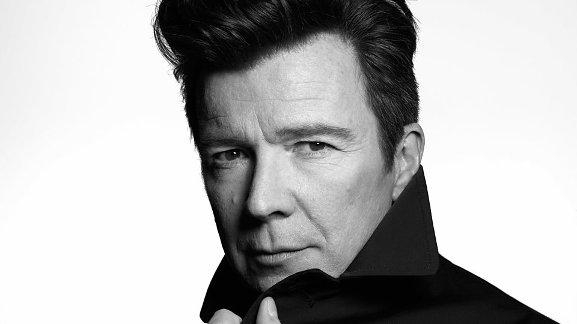

This is an example blog post. It has an introductory section defined in the markdown which can be styled differently.

<!-- end -->

## A blog post Header

This is the body of the blog post written in Markdown, it can have all the normal Markdown bits and bobs, headers, [links](https://www.youtube.com/watch?v=dQw4w9WgXcQ), images etc,

The frontmatter has been setup with a title, date, path (a relative path when published) and a lead image used in the `blog-listing`

Whilst it's called a blog post, you can use it for anything. It's just dynamic content people can edit either directly through Github or via the Netlify CMS if they have an account.

### Embedding content

You can add images to your blog post, it's a pain working out what the paths are by default, so this post includes an image below as an example.

